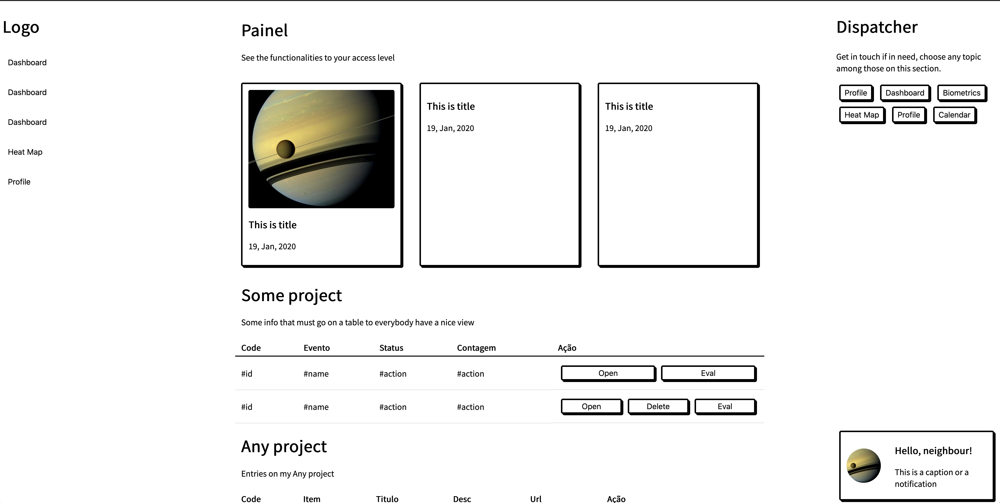

# layouts

## Author 

Lucas G. Santos 
Computer Engineer

## About

This repo contains some layouts I am building with CSS Grid and CSS Flexbox to replace old Bootstrap pages. The layout itself is very shallow, but I am trying to make it compreehensive and abragent in order to fit desktop and mobile version and to have some flexibility in order to be converted to a VueJS or ReactJS project in the future.

## Layout 01 - Desktop Dashboard

The image below illustrate the general structure of the dashboard in desktop view.
It uses the following elements to build the UI:

- nav 
- main 
  - header
  - section 
  - div 
    - header 
    - table 
- aside
   

