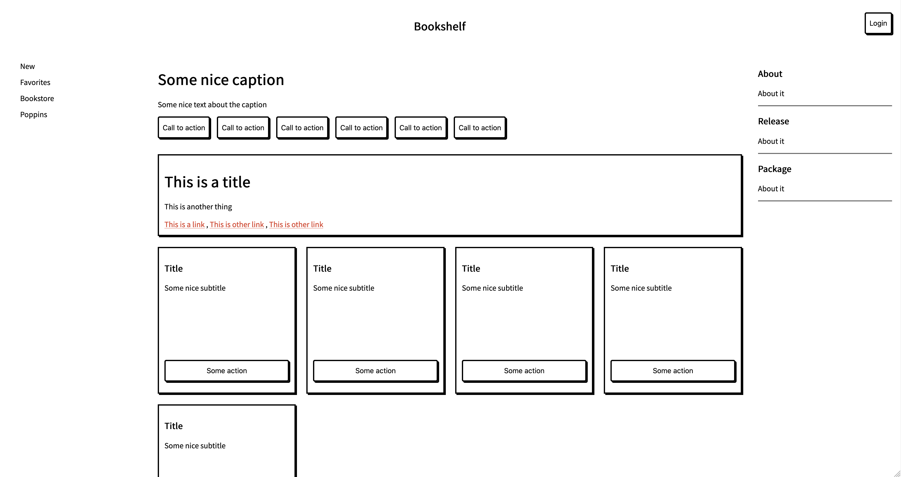

# layouts

Building Comprehensive and Abrangent Layouts for the web. 

## Author 

Lucas Gabriel. Guilherme dos Santos 

Computer Engineer / Fullstack developer
lucas.gabriel@uninta.edu.br / santosworkers@gmail.com 

## About

This repo contains some layouts I am building with CSS Grid and CSS Flexbox to replace old Bootstrap pages. The layout itself is very shallow, but I am trying to make it compreehensive and abragent in order to fit desktop and mobile version and to have some flexibility in order to be converted to a VueJS or ReactJS project in the future.

The components appearance is not its final. The idea behind the project is to provide the layout and UI organization**. 
Cards, buttons, Font-families and more about the design system can be implemented by the interested-self. 

## Version 

I am still deciding the best strategie to control the versioning and name conventions. Ideas can be added in the issues section.

## Layout 01 - Dashboard

The image below illustrate the general structure of the dashboard in desktop view.
It uses the following elements to build the UI:

- nav 
- main 
  - header
  - section 
  - div 
    - header 
    - table 
- aside
   

## Layout 02 - Homepage 

This is a desktop homepage sample.

